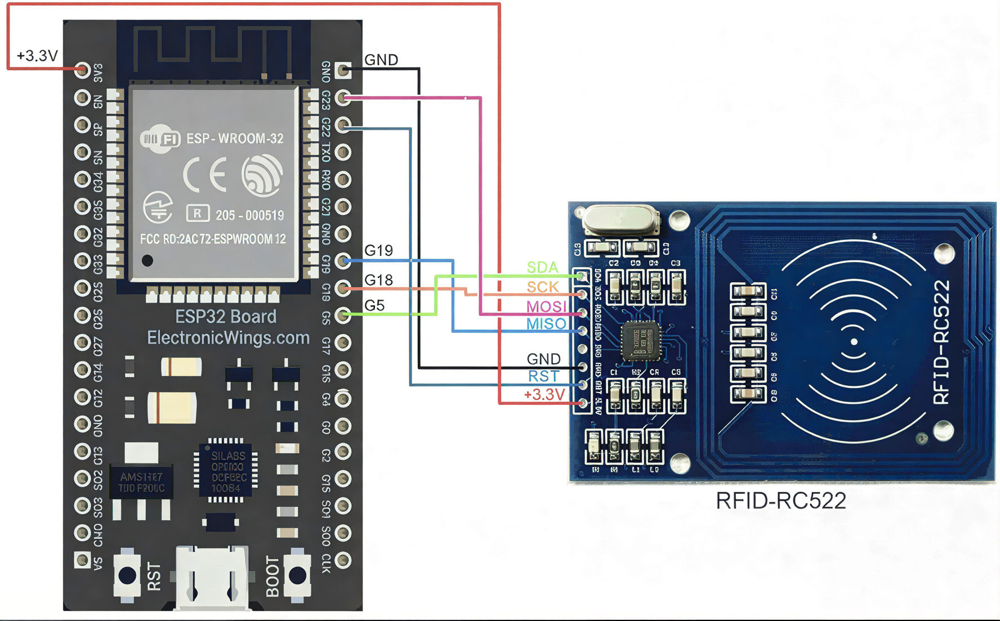

# V1 - Basic RFID Reader (ESP32)

## Description
Reads RFID card UID using ESP32 and MFRC522 via SPI.

## Hardware
- ESP32
- MFRC522 RFID Module

## Circuit Diagram



## Connections

| MFRC522 Pin | ESP32 Pin |
|------------|-----------|
| SDA (SS)   | GPIO 5    |
| SCK        | GPIO 18   |
| MOSI       | GPIO 23   |
| MISO       | GPIO 19   |
| RST        | GPIO 22   |
| VCC        | 3.3V      |
| GND        | GND       |

## Output

UID is printed in the Serial Monitor at 115200 baud.

Example:

```text
UID: A3 7F 2C 91
```

## Author

**Chandu R**  
GitHub: https://github.com/heychandu
