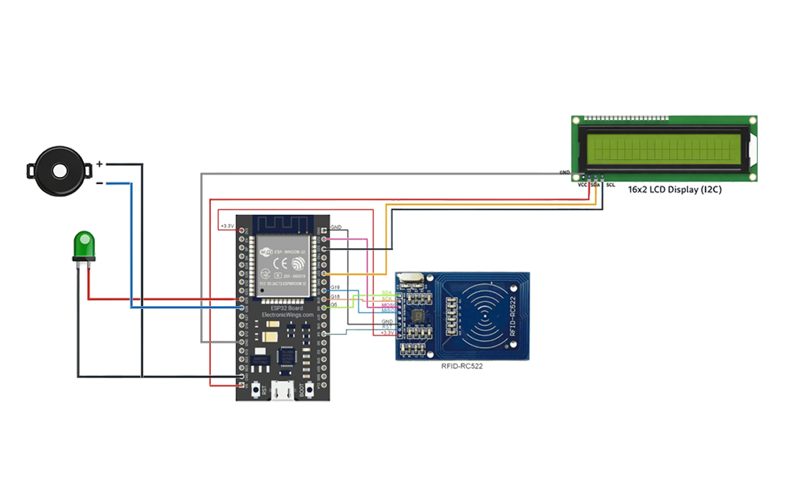

# 🟡 V2 - LCD + Feedback (ESP32)

## 📌 Description
Enhances the basic RFID system by adding a user interface and feedback system using LCD, LED, and buzzer.

---

## 🧠 Hardware
- ESP32  
- MFRC522 RFID Module  
- I2C LCD (16x2)  
- Green LED  
- Buzzer  

---

## 🔌 Circuit Diagram

---

## ⚙️ Connections

### 📡 RFID (SPI)
- SDA (SS) → GPIO 5  
- SCK → GPIO 18  
- MOSI → GPIO 23  
- MISO → GPIO 19  
- RST → GPIO 4  
- VCC → 3.3V ⚠️  
- GND → GND  

### 📟 LCD (I2C)
- SDA → GPIO 21  
- SCL → GPIO 22  
- VCC → 5V  
- GND → GND  

### 🔊 Output Devices
- Green LED → GPIO 26  
- Buzzer → GPIO 25  

---

## 🧪 Output

- LCD displays system messages  
- LED turns ON when card is detected  
- Buzzer gives a short beep  

**System Flow:**  
👉 Scan Card → 📟 Display *"Card Detected"* → 💡 LED ON → 🔊 Buzzer Beep

---

## 🚀 Improvements from V1

- Added LCD display  
- Added buzzer feedback  
- Added LED indication  
- Improved user interaction  

---

## 👨‍💻 Author

**Chandu R**  
🔗 GitHub: [@heychandu](https://github.com/heychandu)