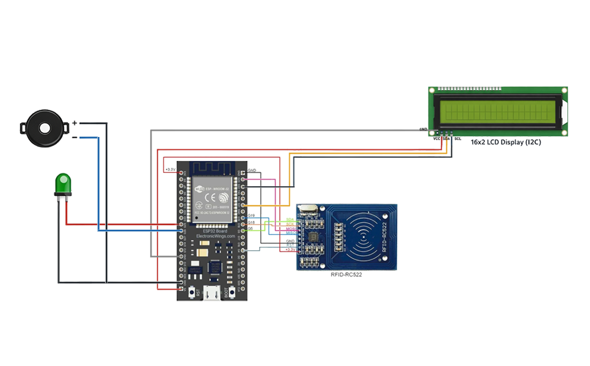

# V3 - Attendance Logic (ESP32)

## Description

Implements attendance logic by identifying RFID cards, assigning user names, and tracking IN/OUT status.

---

## Features

- Recognizes registered RFID cards
- Maps UID to user names
- Marks attendance (IN/OUT)
- Prevents duplicate entries
- Displays results on LCD
- Provides buzzer and LED feedback

---

## Hardware

- ESP32
- MFRC522 RFID Module
- I2C LCD (16x2)
- Green LED
- Buzzer

---

## Circuit Diagram

---

## Connections

### RFID (SPI)

| MFRC522 Pin | ESP32 Pin |
|------------|-----------|
| SDA (SS) | GPIO 5 |
| SCK | GPIO 18 |
| MOSI | GPIO 23 |
| MISO | GPIO 19 |
| RST | GPIO 4 |
| VCC | 3.3V |
| GND | GND |

### LCD (I2C)

| LCD Pin | ESP32 Pin |
|---------|-----------|
| SDA | GPIO 21 |
| SCL | GPIO 22 |
| VCC | 5V |
| GND | GND |

### Output Devices

| Device | ESP32 Pin |
|---------|-----------|
| Green LED | GPIO 26 |
| Buzzer | GPIO 25 |

---

## Output

- Displays user name on the LCD
- Marks attendance as IN or OUT
- Provides audio and visual feedback

### System Flow

Scan Card → Identify UID → Match User → Mark IN/OUT → Display Result

---

## Improvements from V2

- Added UID-based user identification
- Implemented IN/OUT attendance logic
- Prevented duplicate scanning issues
- Improved system intelligence

---

## Author

**Chandu R**  
GitHub: https://github.com/heychandu
