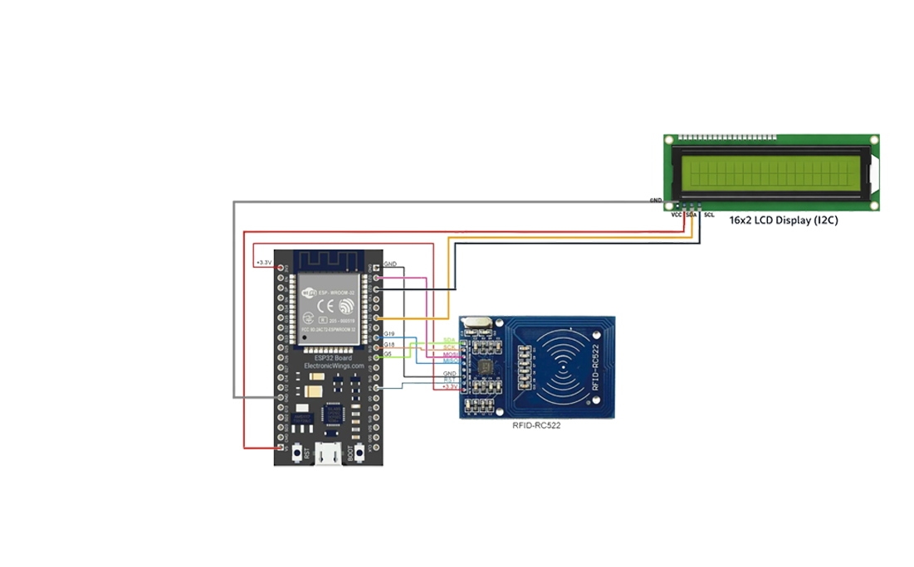

# 🟢 V4 - Cloud Attendance System (ESP32 + Google Sheets)

## 📌 Description
Upgrades the attendance system to cloud-based logging using Google Sheets. Automatically records Time In and Time Out with real-time WiFi communication.

---

## 🧠 Features
- RFID card-based attendance  
- Google Sheets integration (real-time logging)  
- Automatic Time In / Time Out detection  
- Displays Name + Time on LCD  
- Invalid card detection  
- Prevents duplicate entries (Already Done)  
- Clean and simple user interface  

---

## 🧠 Hardware
- ESP32  
- MFRC522 RFID Module  
- I2C LCD (16x2)  

---

## 🔌 Circuit Diagram



---

## ⚙️ Connections

### 📡 RFID (SPI)
- SDA (SS) → GPIO 5  
- SCK → GPIO 18  
- MOSI → GPIO 23  
- MISO → GPIO 19  
- RST → GPIO 4  
- VCC → 3.3V ⚠️  
- GND → GND  

### 📟 LCD (I2C)
- SDA → GPIO 21  
- SCL → GPIO 22  
- VCC → 5V  
- GND → GND  

---

## 🌐 Software & Cloud

- ESP32 (Arduino IDE)  
- Google Apps Script  
- Google Sheets  

---

## 🧪 Output

- Displays user name on LCD  
- Shows attendance time in format:  

```
John
IN: 09:32:10
```

- Logs data in Google Sheets:
  - Name  
  - UID  
  - Date  
  - Time In  
  - Time Out  

**System Flow:**  
👉 Scan Card → 🌐 Send UID → ☁️ Google Sheets → 📊 Process Data → 📟 Display Result  

---

## 🚀 Improvements from V3

- Added WiFi connectivity  
- Integrated Google Sheets for cloud logging  
- Automatic Time In / Time Out system  
- Removed manual data storage in code  
- Improved scalability and real-world usability  

---

## ⚠️ Note
- Hardware feedback components like LED and buzzer used in previous versions have been removed in V4 to simplify the system.

## 👨‍💻 Author

**Chandu R**  
🔗 GitHub: [@heychandu](https://github.com/heychandu)