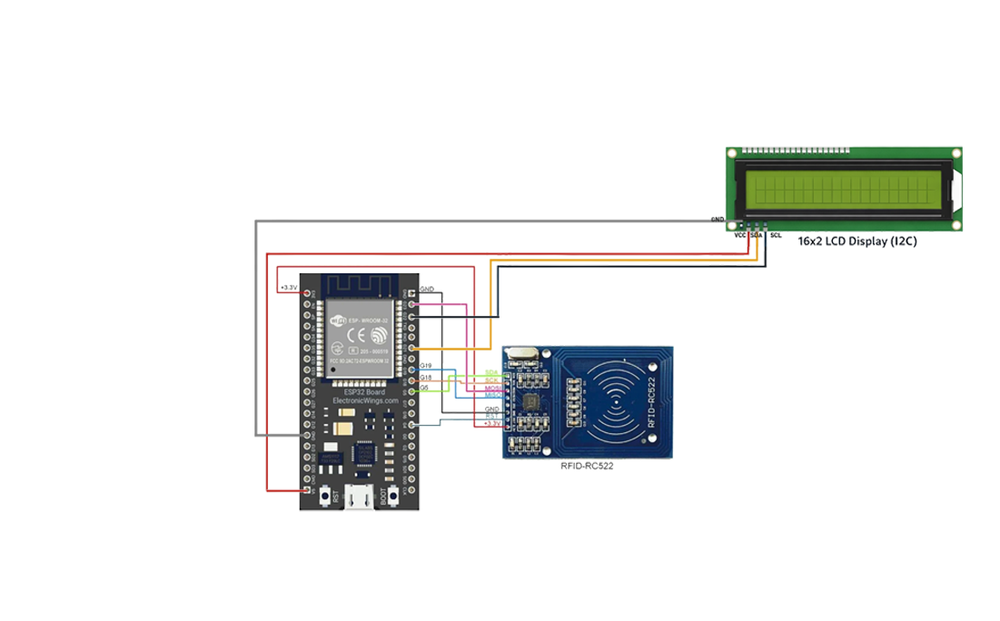

# V4 - Cloud Attendance System (ESP32 + Google Sheets)

## Description

Upgrades the attendance system to cloud-based logging using Google Sheets. Automatically records Time In and Time Out with real-time WiFi communication.

---

## Features

- RFID card-based attendance
- Google Sheets integration for real-time logging
- Automatic Time In / Time Out detection
- Displays Name and Time on LCD
- Invalid card detection
- Prevents duplicate entries (Already Done)
- Clean and simple user interface

---

## Hardware

- ESP32
- MFRC522 RFID Module
- I2C LCD (16x2)

---

## Circuit Diagram



---

## Connections

### RFID (SPI)

| MFRC522 Pin | ESP32 Pin |
|------------|-----------|
| SDA (SS) | GPIO 5 |
| SCK | GPIO 18 |
| MOSI | GPIO 23 |
| MISO | GPIO 19 |
| RST | GPIO 4 |
| VCC | 3.3V |
| GND | GND |

### LCD (I2C)

| LCD Pin | ESP32 Pin |
|---------|-----------|
| SDA | GPIO 21 |
| SCL | GPIO 22 |
| VCC | 5V |
| GND | GND |

---

## Software & Cloud

- ESP32 (Arduino IDE)
- Google Apps Script
- Google Sheets
- WiFi Communication

---

## Output

- Displays the user name on the LCD
- Shows attendance status and time in the format:

```text
John
IN: 09:32:10
```

- Logs data directly to Google Sheets:

| Field |
|---------|
| Name |
| UID |
| Date |
| Time In |
| Time Out |

### System Flow

Scan Card → Send UID → Google Apps Script → Google Sheets → Process Attendance → Display Result

---

## Improvements from V3

- Added WiFi connectivity
- Integrated Google Sheets for cloud logging
- Implemented automatic Time In / Time Out detection
- Removed manual attendance storage in the ESP32 code
- Improved scalability and real-world usability
- Centralized attendance records in the cloud

---

## Note

- Hardware feedback components such as the LED and buzzer used in previous versions have been removed in V4 to simplify the system design.
- Requires a stable WiFi connection and a deployed Google Apps Script Web App.

---

## Author

**Chandu R**  
GitHub: https://github.com/heychandu
