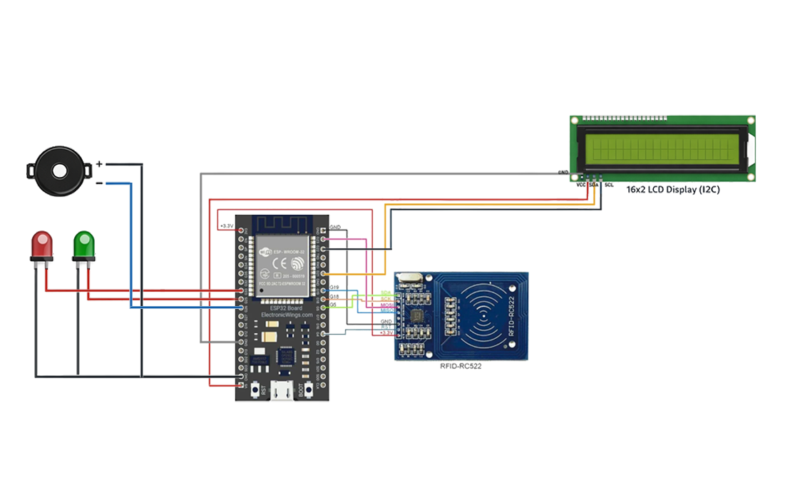

# 🔵 V5 - Smart Cloud RFID Attendance System (ESP32 + Google Sheets)

## 📌 Description

Enhances the cloud-based attendance system with advanced features like register mode, button-based mode switching, and hardware feedback. Provides a complete real-world attendance solution with improved UI and system interaction.

---

## 🧠 Features

* RFID card-based attendance
* Google Sheets integration (real-time logging)
* Automatic Time In / Time Out detection
* Register mode for adding new RFID cards
* Button-based mode switching (Attendance / Register)
* Displays Name + Time on LCD
* LED and buzzer feedback system
* Invalid card detection
* Prevents duplicate entries (Already Done)
* Clean UI (no flicker, no debug text, no "OK" messages)

---

## 🧠 Hardware

* ESP32
* MFRC522 RFID Module
* I2C LCD (16x2)
* Push Button
* Green LED
* Red LED
* Buzzer

---

## 🔌 Circuit Diagram



---

## ⚙️ Connections

### 📡 RFID (SPI)

* SDA (SS) → GPIO 5
* SCK → GPIO 18
* MOSI → GPIO 23
* MISO → GPIO 19
* RST → GPIO 4
* VCC → 3.3V ⚠️
* GND → GND

### 📟 LCD (I2C)

* SDA → GPIO 21
* SCL → GPIO 22
* VCC → 5V
* GND → GND

### 🔘 Button

* One side → GPIO 15
* Other side → GND

### 🔊 Output Devices

* Green LED → GPIO 26
* Red LED → GPIO 27
* Buzzer → GPIO 25

---

## 🌐 Software & Cloud

* ESP32 (Arduino IDE)
* Google Apps Script
* Google Sheets

---

## 🧪 Output

### Attendance Mode

```
John
IN: 09:32:10
```

### Register Mode

```
Registered
```

### Error States

```
Invalid Card
Already Done
```

* Logs data in Google Sheets:

  * Name
  * UID
  * Date
  * Time In
  * Time Out

**System Flow:**
👉 Scan Card → 🌐 Send UID → ☁️ Google Sheets → 📊 Process Data → 📟 Display Result → 🔊 Feedback

---

## 🚀 Improvements from V4

* Added register mode for new card enrollment
* Implemented button-based mode switching
* Added LED and buzzer feedback system
* Removed "OK" response dependency
* Improved LCD UI (no flicker, cleaner transitions)
* Enhanced user interaction and system usability


---

## 👨‍💻 Author

**Chandu R**
🔗 GitHub: [@heychandu](https://github.com/heychandu)
