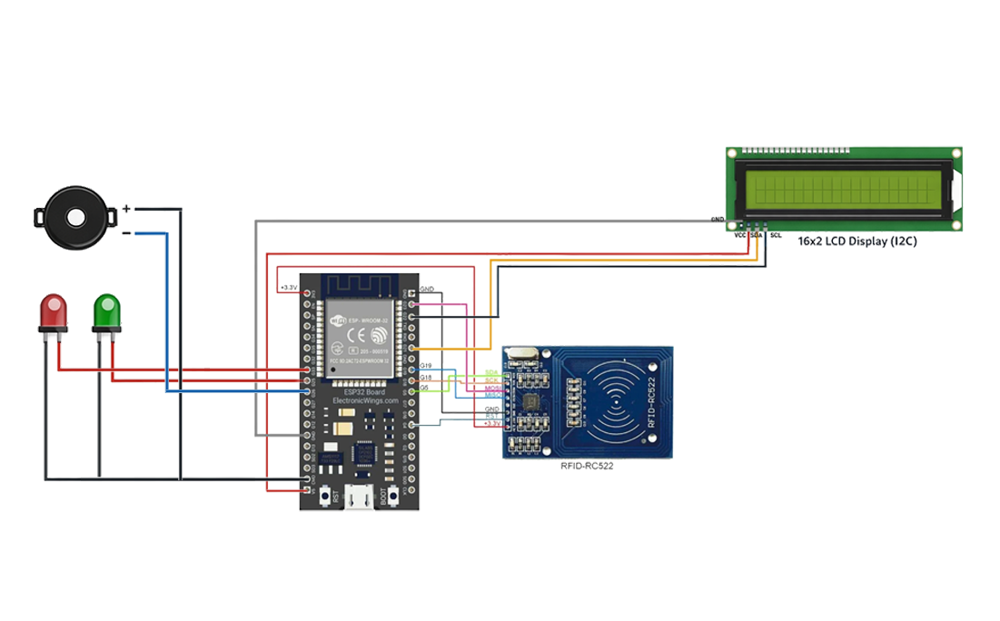

# V5 - Smart Cloud RFID Attendance System (ESP32 + Google Sheets)

## Description

Enhances the cloud-based attendance system with advanced features such as register mode, button-based mode switching, and hardware feedback. Provides a complete real-world attendance solution with improved user interaction and system usability.

---

## Features

- RFID card-based attendance
- Google Sheets integration for real-time logging
- Automatic Time In / Time Out detection
- Register mode for adding new RFID cards
- Button-based mode switching (Attendance / Register)
- Displays Name and Time on LCD
- LED and buzzer feedback system
- Invalid card detection
- Prevents duplicate entries (Already Done)
- Clean user interface with no flicker or unnecessary messages

---

## Hardware

- ESP32
- MFRC522 RFID Module
- I2C LCD (16x2)
- Push Button
- Green LED
- Red LED
- Buzzer

---

## Circuit Diagram



---

## Connections

### RFID (SPI)

| MFRC522 Pin | ESP32 Pin |
|------------|-----------|
| SDA (SS) | GPIO 5 |
| SCK | GPIO 18 |
| MOSI | GPIO 23 |
| MISO | GPIO 19 |
| RST | GPIO 4 |
| VCC | 3.3V |
| GND | GND |

### LCD (I2C)

| LCD Pin | ESP32 Pin |
|---------|-----------|
| SDA | GPIO 21 |
| SCL | GPIO 22 |
| VCC | 5V |
| GND | GND |

### Push Button

| Button Pin | ESP32 Pin |
|------------|-----------|
| One Side | GPIO 15 |
| Other Side | GND |

### Output Devices

| Device | ESP32 Pin |
|---------|-----------|
| Green LED | GPIO 26 |
| Red LED | GPIO 27 |
| Buzzer | GPIO 25 |

---

## Software & Cloud

- ESP32 (Arduino IDE)
- Google Apps Script
- Google Sheets
- WiFi Communication

---

## Output

### Attendance Mode

```text
John
IN: 09:32:10
```

### Register Mode

```text
Registered
```

### Error States

```text
Invalid Card
```

```text
Already Done
```

### Data Logged in Google Sheets

| Field |
|---------|
| Name |
| UID |
| Date |
| Time In |
| Time Out |

### System Flow

Scan Card → Send UID → Google Apps Script → Google Sheets → Process Data → Display Result → Feedback

---

## Improvements from V4

- Added register mode for new card enrollment
- Implemented button-based mode switching
- Added LED and buzzer feedback system
- Removed dependency on simple "OK" responses
- Improved LCD interface with smoother transitions
- Enhanced user interaction and usability
- Added visual and audio status indication

---

## Note

- Requires a stable WiFi connection and a deployed Google Apps Script Web App.
- Register mode allows new RFID cards to be added directly without modifying the ESP32 firmware.

---

## Author

**Chandu R**  
GitHub: https://github.com/heychandu
